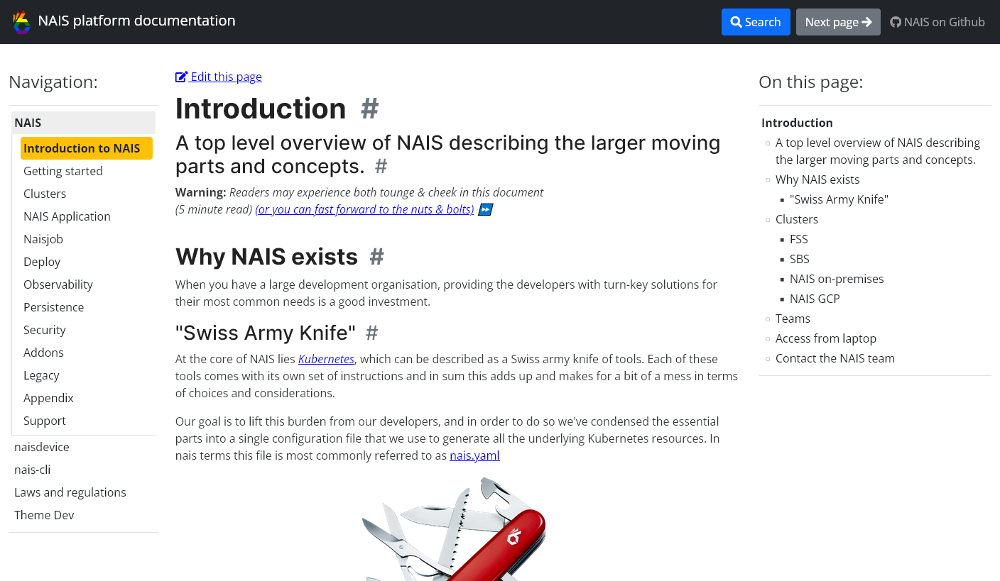

# NAV IT (NAIS) UU-vennlig dokumentasjon
Bacheloroppgave for bachelorstudie i anvendt datateknologi. Målet med denne oppgaven var å
universell utforme dokumentasjonen til NAIS plattform hos NAV IT.

> *Dette er en substitutt repo da den orginale finnes ikke lenger.*
> *Orginal repo befant seg under denne lenken: https://github.com/nais/oslomet-nais-docs og var hovedområdet for dette prosjektet.*
> *Løsningen utarbeidet under dette prosjektet var utplassert under denne lenken: https://nais.io/oslomet-nais-docs/ som også finnes ikke lenger.*

## Prosjektbeskrivelse
Diskriminering og tilgjengelighetsloven §11 stiller krav til universell utforming av Informasjons- og kommunikasjonstjenester til offentlige og private virksomheter ([Lovdata, 2008](https://lovdata.no/dokument/LTI/lov/2008-06-20-42)). NAIS er applikasjonsteamet til NAV ([nais.io](https://doc.nais.io/)), NAIS tok derfor kontakt med OsloMet for bachelorprosjekt rundt NAIS sin plattform. Plattformen var ikke oppdatert i tråd med WCAG 2.1, som det har blitt krav om i 2022 og må utføres innen februar 2023 for at bedriften skal unngå bøteleggelser. Da NAV tok kontakt med universitetet brukte NAIS statisk sidegeneratorer som da skapte en statisk nettside etter definert innhold fra tidligere versjoner. Slike sidegeneratorer lager sider etter instrukser, men er ikke godt egnet hvis målet er å lage universelle utformede sider. NAV har sett etter løsninger, men ingen av dem har gitt et godt nok resultat. Et siste forsøk var å definere en generator selv, men det var mye mer tidkrevende enn forventet. 

Konkrekt så ønsket NAV en dokumenstasjons-side-generator som ville generere UU-vennlig dokumentasjon. Dette var årsaken til at NAV tok kontakt med OsloMet om forslag til bachelorprosjekt. Ingen av de eksisterende statisk side generatorene genererer en dokumentasjonsnettsside som oppfyller kravene relatert til UU. Derfor handlet oppgaven under dette prosjektet om å modifisere en slik generator slik at dokumentasjonsnettsidene som genereres oppfyller kravene som forventes i henhold til lovverket.

## Løsningen
Problemet ble løst ved å utvikle en ham for [MkDocs](https://www.mkdocs.org/) (statisk sidegenerator). En ham i MkDocs er ansvarlig for hvordan den endelige nettsiden blir generert, og målet for dette prosjektet ble derfor å modifisere en ham for MkDocs programmet.

Ham for MkDocs er ikke noe spesielt i seg selv. Dette er vanlig HTML/CSS/JS nettside  som inneholder spesielle variabler. Variablene bruker MkDocs til å endre innholdet dynamisk. Det gir også tilgang til hele HTML/CSS/JS skriptet. På denne måten har en mulighet til å påvirke hvordan den endelige nettsiden blir laget. 

Resultatet av dette bachelorprosjektet er en ham for MkDocs. Denne hammen er en modifisert versjon med [Cinder Theme for MkDocs](https://sourcefoundry.org/cinder/). Den ble oppgradert til å støtte flere UU retningslinjer, definert av WCAG 2.1. Produktet er fremdeles ikke ferdig, noe som betyr at det fortsatt gjenstår arbeid før produktet er fullstendig. Alt tatt i betraktning er produktets nåværende tilstand bedre enn det var da vi fikk oppgaven og støtter flere av kravene til WCAG 2.1.

*NAIS dokumentasjonen laget ved hjelp av en modifisert UU-vennlig MkDocs ham*

## Bruk av løsningen
Det er mulig å benytte seg av MkDocs hammen utviklet under dette prosjektet. For å gjøre det, følg original cinder theme instrukser om hvordan gjøres det: https://sourcefoundry.org/cinder/. 
Hammen befinner seg inn i `cinder` katalogen.